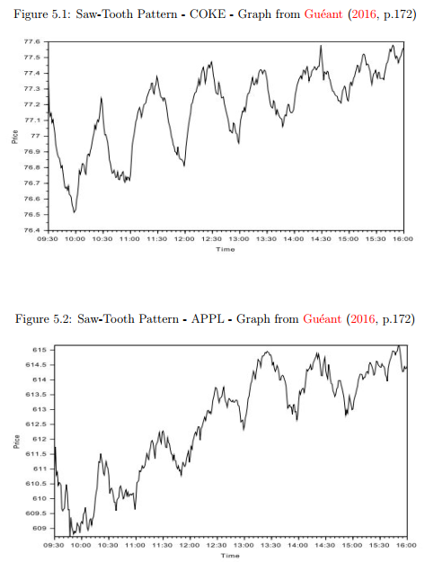
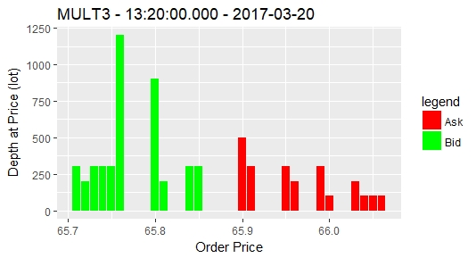
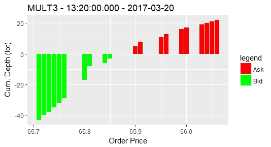
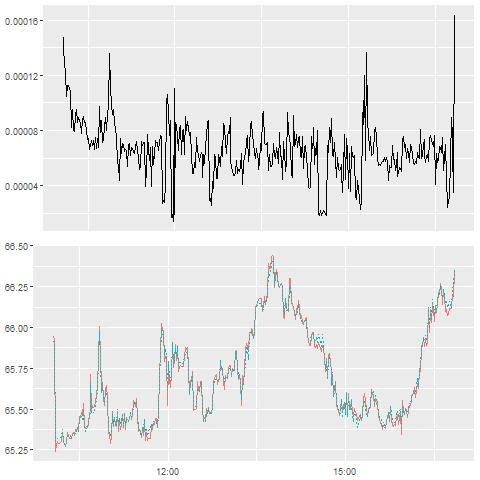
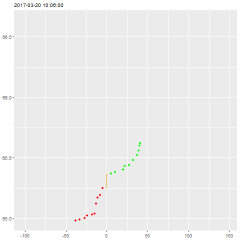

# Stochastic Supply Curve with Binance's API endpoint
## Introduction
Project presented as a partial fullfilment requirement for the
Cardano Developer Professional (CDP) program.

An implementation of the Stochastic Supply Curve 
(Çetin, Jarrow & Protter, 2004) based on Blais & Protter (2010), 
Árdal (2013) and Hossaka (2018) approaches through Binance's API endpoint live feed data. 

## Status
* [X] Network.Wreq API on Binance's endpoint;
* [X] IO JSON Parser for GET method data;
* [X] Implementation of records and data types;
* [X] Treating data and getting indicators;
* [X] Simple SSC regression;
  * [X] Checking OLS results;
  * [X] R<sup>2</sup>.
* [X] Organising files (app.Main, app.Utils, app.SSC): the damn thing is running with ```cabal repl```, ```:l repl.hs``` and by calling the ```main``` function explicitly (```cabal run``` not working);
* [ ] Static plots on Haskell (no cheating with R or Python);
* [ ] Live updates of plots (cheating with Python);
  * [X] CSV live feed update (cheating with Python);
  * [X] Real time plots. Kinda of... ```system $ "python pyfile.py"```;
* [ ] Definitely improving the types in the future...
* [ ] Saving CSV with Haskell;
* [ ] Concurrent non-vanishing thread (```controlProcess``` instead of the simple ```system $```);
* [ ] Plotting with Haskell seems only feasible under Nix ¬¬;
* [ ] Implement Stoikov (2018)!!!

## A note on Python
Python has to be installed with the libraries in [requirementsPy.yaml](requirementsPy.yaml). ```livePlot_AAAA.py``` scripts have to be run separately, one environment for each possible plot.

Both saving 

... to be improved.

## Stochastic Processes - GBM and Liquidity Costs + Market Impact 

Classical Geometrical Brownian Motion:

$$
\begin{aligned}
dS_{t} = \mu S_{t}dt + \sigma S_{t}dW_{t}
\end{aligned}
$$

The Stochastic Process for an asset price $S_{t}$ under Almgren-Chriss(1999):

$$
\begin{aligned}
dS_{t} = \sigma dW_{t} + kv_{t}dt
\end{aligned}
$$


Under this economy, the expectation of the cash balance at the end of the execution schedule, $\mathbb{E}[X_{T}]$, incorporates both permanent market impact and liquidity costs:

$$
\begin{aligned}
\mathbb{E}[X_{T}] = \overset{MtM value}{\overbrace{X_{0}+q_{0}S_{0}}} - \overset{perm. m. i.}{\overbrace{\frac{k}{2}q_{0}^{2}}} - \overset{Liquidity Costs}{\overbrace{\int_{0}^{T}V_{t}L\left(\frac{v_{t}}{V_{t}}\right)dt}}.
\end{aligned}
$$
\v
The first term is the Mark-to-Market value of the portfolio at time $t=0$. The second term corresponds to costs coming from the permanent market impact and, surprisingly, is not dependent on $v_{t}$, thus, being unavoidable. 

The third and final term, the Liquidity Cost, is the only one varying with the control $(v_{t})_{t \in [0,T]}$. The function $L\left(\frac{v_{t}}{V_{t}}\right)$ is assumed to be convex and it is minimal when is proportional do $V_{t}$. 

## Extreme Example: Market Liquidity Risk - The Saw-Tooth Pattern
The "Saw-Tooth Pattern": Lehalle (2012) and Guéant (2016):


## SSC on Order Book Data

The Limit Order Book (LOB from now on) is considered to be the ``ultimate microscopic level of description of financial markets´´ (Bouchaud et. ali, 2002).

Even though it is a static picture, a snapshot of market conditions at a fixed time, it is far from being stationary and well-behaved: complicated global phenomena emerge from interactions between heterogeneous agents (Gould et. ali, 2013).

Market conditions may be path-dependent and building a LOB through time relies heavily on data consistency and studying its conditional behavior is complex. As explained by Gould et ali (2013) this is so because its state space is huge: if there are P different choices for a price in a given LOB, then the state space of the current depth (volume/quantity for a bid/ask price) profile alone expressed in a lot size $\nu$ is $\mathbb{Z}^{p} $.

A LOB organizes prices and quantities for an order-driven market and, as one the main points in this work, when there is Market Liquidity Risk it may change and change deeply, rapidly and drastically. 



Let $(P_{i}, \sum^{k})$ be the k-th level of depth at price $P_{i}$ from the bid side of a LOB. Each level of depth on the bid side is provides liquidity for a given buying order of size $v_{B}$ and, on the converse, a $(-P_{j},\sum^{m})$ is a point providing liquidity for a selling order. 

Since the volume is monotone over the depth of each side of the LOB, the Stochastic Supply Curve is expected to have an upward slope such as follows:



A possible simple estimate of the $\alpha$ parameter can be done as follows:

$$
\begin{aligned}
S(t,\Delta X_{i}) &= S(t,0) \exp(\alpha_{t} \Delta X_{i} + \epsilon_{i}) \Rightarrow\\
\log(S(t,\Delta X_{i})) &= \log(S(t,0)) + \alpha_{t} \Delta X_{i} + \epsilon_{i}.
\end{aligned}
$$

If $S(t,0)$ is a log-normal GBM than $\log(S(t,\Delta X))$ is Gaussian. This model, though, does not address $\alpha < 0$ condition. 

Parametric interpretation of log-level assumes a convenient form in this approach. Taking the derivative of Y with respect to $\Delta X$ and then solving for $\alpha_{t}$ one obtains directly:

$$
\begin{aligned}
\frac{\partial}{\partial \Delta X}S(t,\Delta X_{i}) &= \frac{\partial}{\partial \Delta X}S(t, \Delta X)\exp(\alpha_{t} \Delta X_{i} + \epsilon_{i}) \\
&= \alpha_{t}\overset{S(t,\Delta X_{i})}{\overbrace{S(t,\Delta X)\exp(\alpha_{t} \Delta X)}}\\
\alpha_{t}&= \frac{\partial}{\Delta X}S(t,\Delta X_{i})\frac{1}{S(t,\Delta X_{i})}.
\end{aligned}
$$

This means that a change in one $\Delta X$ unit, for instance, shares in lot units, will delivers $\alpha_{t}$\% change in $S(t,\Delta X_{i})$.
## Other Definitions on Market Microstructure - Notes from Stoikov (2017)

$$
\begin{aligned}
P^{a} &:= \text{Ask price is the lowest selling price} \\
P^{b} &:= \text{Bid price is the highest buying price} \\
Q^{a} &:= \text{Ask size is the total volume at } P^{a} \\
Q^{b} &:= \text{Bid size is the total volume at } P^{b}
\end{aligned}
$$

Mid-price:

$$
\begin{aligned}
M &= \frac{P^{a} + P^{b}}{2}
\end{aligned}
$$

Imbalance:

$$
\begin{aligned}
I &= \frac{Q^{b}}{Q^{a} + Q^{b}}
\end{aligned}
$$

Weighted mid-price:

$$
\begin{aligned}
\bar{M} &= P^{b} ( 1 - I) + P^{a} I
\end{aligned}
$$

Bid-ask spread:

$$
\begin{aligned}
S = (P^{a} - P^{b})
\end{aligned}
$$

## The mid vs. weighted mid

The mid-price:
* Not a martingale (Bid-ask bounce);
* Medium frequency signal;
* Doesn't use volume at the best bid and ask prices.

The weigheted mid-price:
* Uses the volume at the best bid and ask prices;
* High frequency signal;
* Is quite noise, particularly when the spread widens to two ticks.

## Main Goal: Reproduce Hossaka (2018) in Haskell
Reproduce ideas from Hossaka (2018) in Haskell, specially based on the following plots with live feed data!



Both plots report price moevements of MULT3 Brazilian equity on March 20<sup>th</sup> 2017.

The first plot gives the path of the $\alpha$ liquidty parameter that could eventually be an stochastic processes/SDE on its on right. 

The second one gives the path of the bid and ask prices.

The animated gif below shows the evolution of the Stochastic Supply Curve minute-by-minute.



## References

Robert Almgren and Neil Chriss. Value under liquidation. Risk, 12(12):61–63, 1999.

Hannes Ardal. A supply curve analysis for the Icelandic Housing Financing Fund bond market. PhD thesis, University of Iceland, 2013.

Marcel Blais and Philip Protter. An analysis of the supply curve for liquidity risk through book data.International Journal of Theoretical and Applied Finance, 13(06):821–838, 2010.

Jean-Philippe Bouchaud, Marc M´ezard, Marc Potters, et al. Statistical properties of stock order books: empirical results and models. Quantitative finance, 2(4): 251-256, 2002.

Umut Çetin, Robert A Jarrow, and Philip Protter. Liquidity risk and arbitrage pricing theory. Finance and stochastics, 8(3):311–341, 2004.

Umut Cetin, Robert Jarrow, Philip Protter, and Mitch Warachka. Pricing options in an extended black scholes economy with illiquidity: Theory and empirical evidence. The Review of Financial Studies, 19(2):493–529, 2006

Martin D Gould, Mason A Porter, Stacy Williams, Mark McDonald, Daniel J Fenn, and Sam D Howison. Limit order books. Quantitative Finance, 13(11): 1709-1742, 2013.

Guilherme Hideo Assaoka Hossaka. Stochastic Supply Curves and Liquidity Costs: Estimation for Brazilian Equities. MSc dissertation, School of Applied Mathematics (EMAp), Getúlio Vargas Foundation - RJ, 2013.

Sasha Stoikov. The micro-price: a high-frequency estimator of future prices. Quantitative Finance. Taylor & Francis Journals, vol. 18(12), 1959-1966, 2018.